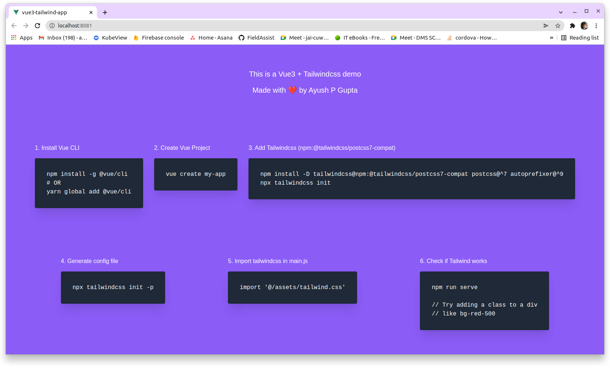

# vue3-tailwind-app

Demonstration of using Tailwindcss in Vue3.

### Note
 Currently Tailwindcss 3 isn't supported in Vue3 due to postcss 8 incompatibility. Hence we are using `npm:@tailwindcss/postcss7-compat` or Tailwindcss v2

## Getting Started

1. Clone respository
2. Run `npm install`
3. Run `npm run serve`

### Customize configuration
See [Configuration Reference](https://cli.vuejs.org/config/).
